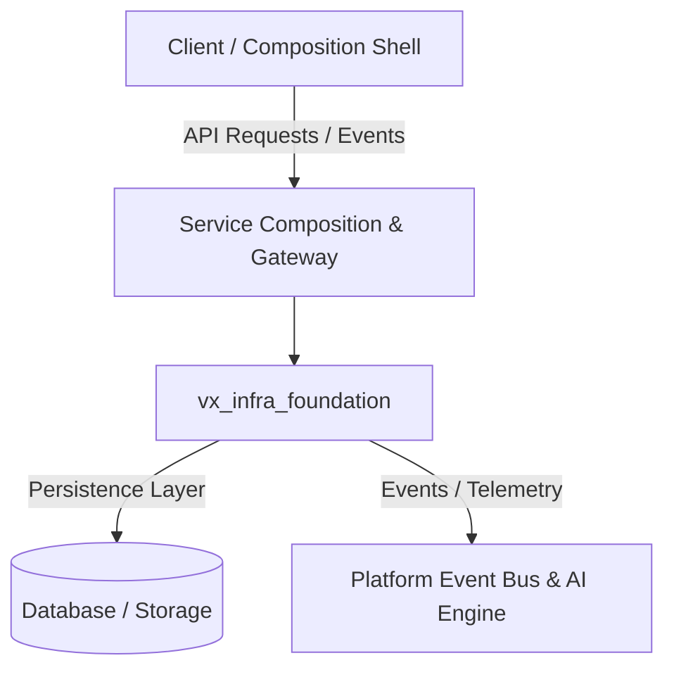

# vx_infra_foundation


## 📌 Purpose & Scope

Infrastructure as Code (IaC) repository containing AWS Terraform modules, VPC network topologies, EKS Kubernetes cluster provisioning, RDS PostgreSQL, MongoDB Atlas, and ElastiCache Redis setups.

**Official Repository Purpose**: `Cloud, networking, compute, storage, databases and runtime foundation`

---

## 🏗️ Architecture & Component Boundaries



### Module Structure & Responsibilities

- `terraform-aws-vpc`: Module component implementation.
- `terraform-aws-eks`: Module component implementation.
- `terraform-aws-rds`: Module component implementation.
- `helm-charts`: Module component implementation.

---

## 🛠️ Technology Stack & Dependencies

- **Capability Classification**: `INFRASTRUCTURE`
- **Repository Identifier**: `INFRA-0001`
- **Core Technology Stack**: `Terraform / AWS / Kubernetes / Helm / Terragrunt`
- **GitHub Remote**: [https://github.com/varhavix-org/vx_infra_foundation.git](https://github.com/varhavix-org/vx_infra_foundation.git)

---

## 🚀 Getting Started & Local Development

### Prerequisites

- Node.js `20.x` or Python `3.14+` (depending on service stack)
- Git & Git LFS
- Docker & Kubernetes Client CLI

### Installation & Initialization

1. **Clone the Repository**:
   ```bash
   git clone https://github.com/varhavix-org/vx_infra_foundation.git
   cd vx_infra_foundation
   ```

2. **Configure Local Environment**:
   ```bash
   cp .env.example .env 2>/dev/null || touch .env
   ```

3. **Install Dependencies & Run**:
   ```bash
   # For Node.js based services:
   npm install && npm run dev

   # For Python based services:
   python3 -m venv .venv && source .venv/bin/activate
   pip install -r requirements.txt 2>/dev/null || pip install fastapi uvicorn
   ```

---

## 🔐 Security & Compliance

- All code commits must be signed and authored by verified VarhaviX organization accounts (`technology@varhavix.com`).
- Secrets, tokens, and credentials must never be committed to source code. Use Environment Secrets / AWS Secrets Manager.
- Enforce strict static analysis and vulnerability scanning via `vx_security` pipeline controls.

---

## 📄 License & Organization Metadata

Copyright © 2026 **VarhaviX Technology Organization**. All Rights Reserved.  
*Internal Proprietary Software - Confidential.*
